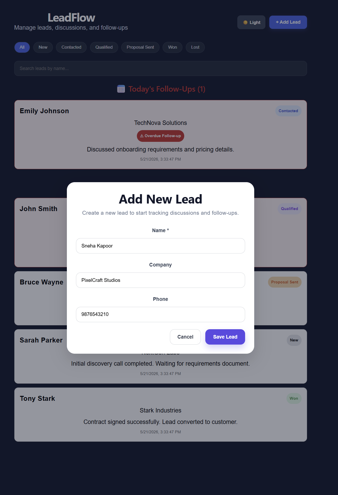
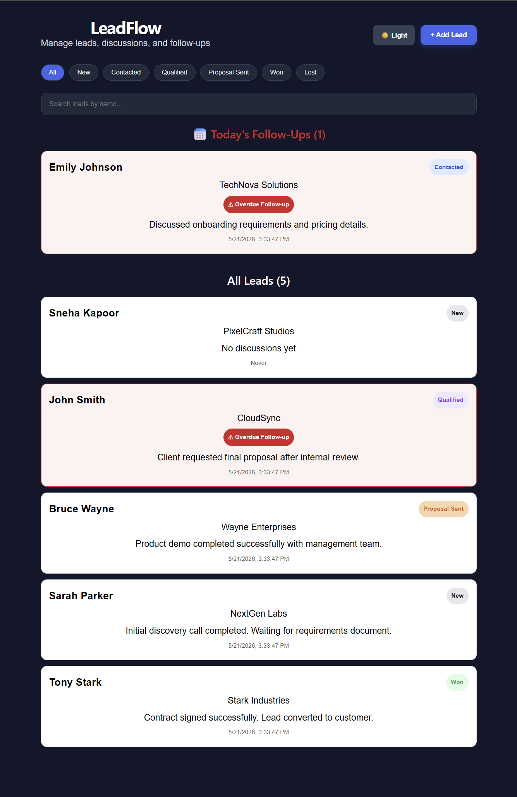
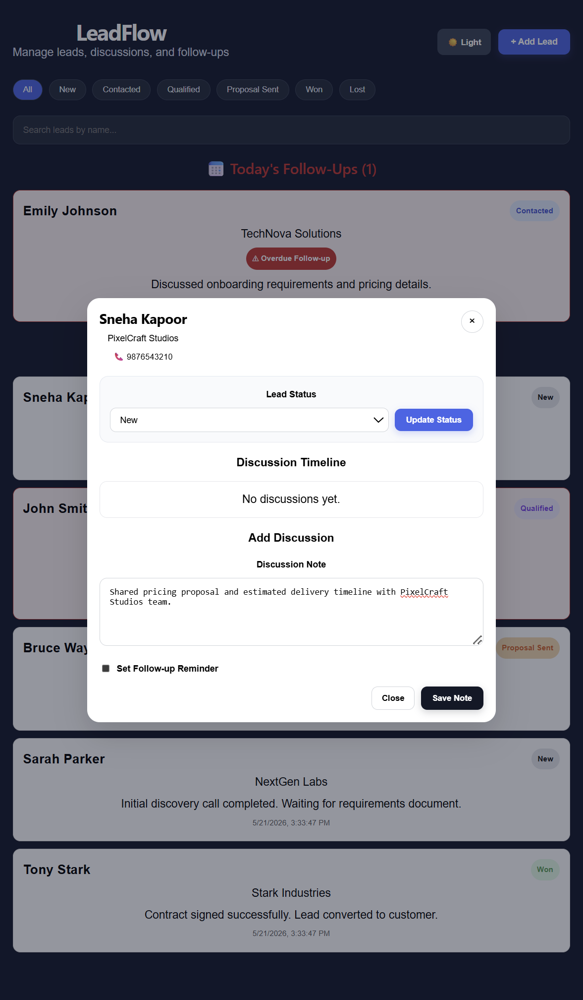
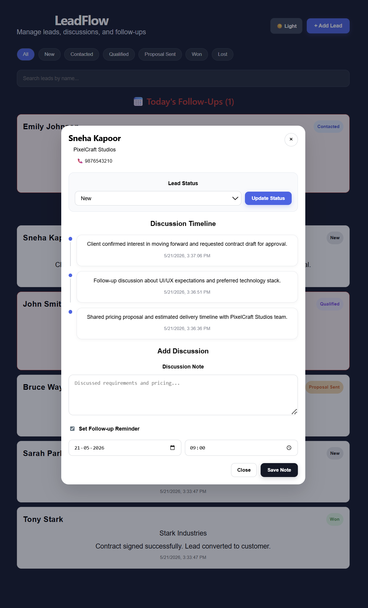
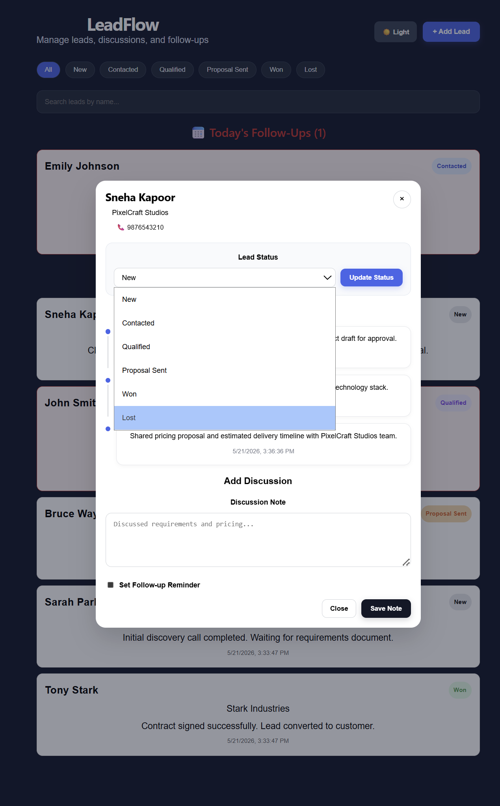
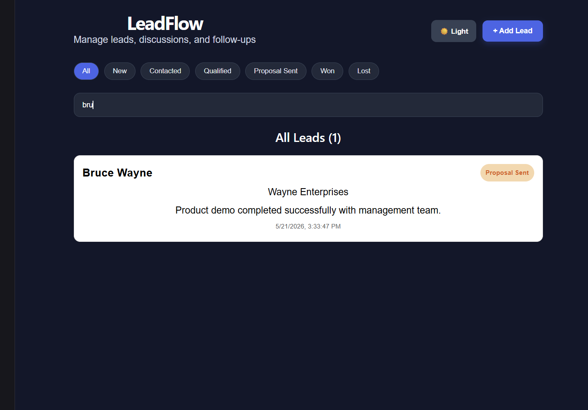
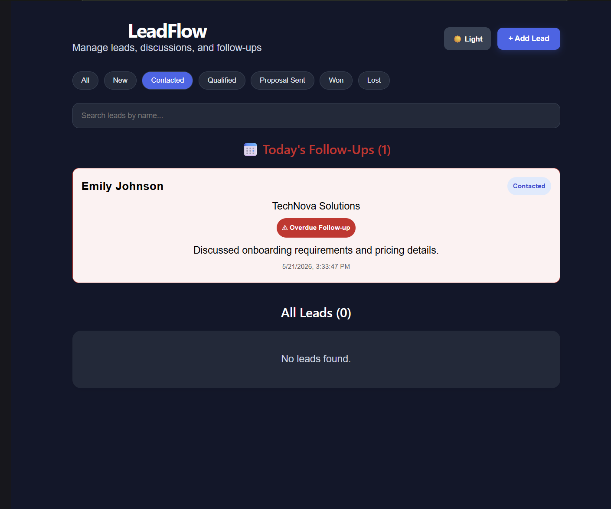
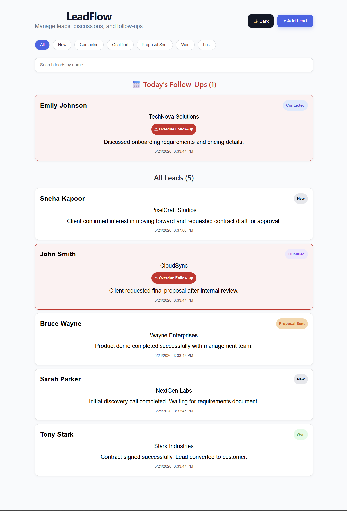
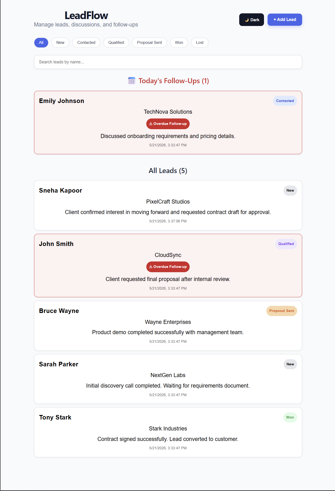

# 🚀 LeadFlow CRM

LeadFlow CRM is a full-stack customer relationship management (CRM) application built to manage leads, discussions, follow-ups, and sales status tracking.

The application allows users to:

- ➕ Create and manage leads
- 📝 Track discussion history
- 📅 Schedule follow-up reminders
- 🔄 Update lead statuses
- 🔍 Filter and search leads
- ⚠️ Highlight overdue and today's follow-ups

---

# 🛠️ Tech Stack

## 🎨 Frontend

- React
- Vite
- JavaScript
- Inline CSS Styling

## ⚙️ Backend

- Node.js
- Express.js

## 🗄️ Database

- PostgreSQL
- pgAdmin

---

# ✨ Features

- 📌 Lead creation and management
- 🕒 Discussion timeline tracking
- 📅 Follow-up scheduling
- 🔄 Lead status updates
- 🔍 Search functionality
- 🎯 Status filtering
- ⚠️ Overdue follow-up detection
- 📌 Today's follow-up prioritization
- 🌙 Dark mode support

---

# 📁 Project Structure

```bash
leadflow/
│
├── client/        # React frontend
├── server/        # Express backend
├── screenshots/   # Application screenshots
├── README.md
└── .gitignore
```

---

# ⚡ Setup Instructions

## 1️⃣ Clone Repository

```bash
git clone https://github.com/smitastack/Leadflow-CRM.git
```

---

## 2️⃣ Create PostgreSQL Database

Create a PostgreSQL database named:

```bash
leadflowdb
```

You can create it using:

- PostgreSQL CLI
- pgAdmin

---

## 3️⃣ Create Required Tables

Run the following SQL queries in PostgreSQL or pgAdmin:

```sql
CREATE TABLE users (
  id SERIAL PRIMARY KEY,
  name VARCHAR(100) NOT NULL,
  created_at TIMESTAMP DEFAULT NOW()
);

CREATE TABLE leads (
  id SERIAL PRIMARY KEY,
  name VARCHAR(100) NOT NULL,
  company VARCHAR(100),
  phone VARCHAR(20),
  status VARCHAR(50) DEFAULT 'New',
  follow_up_at TIMESTAMP,
  assigned_to INTEGER REFERENCES users(id),
  created_at TIMESTAMP DEFAULT NOW(),
  updated_at TIMESTAMP DEFAULT NOW()
);

CREATE TABLE discussions (
  id SERIAL PRIMARY KEY,
  lead_id INTEGER REFERENCES leads(id) ON DELETE CASCADE,
  note TEXT NOT NULL,
  created_at TIMESTAMP DEFAULT NOW()
);
```

---

## 4️⃣ Seed Sample Data

Run the following command to insert sample users, leads, and discussions into the database:

```bash
node seed.js
```

---

## 5️⃣ Backend Setup

```bash
cd server
npm install
npm run dev
```

Backend server runs on:

```bash
http://localhost:5000
```

---

## 6️⃣ Frontend Setup

```bash
cd client
npm install
npm run dev
```

Frontend runs on:

```bash
http://localhost:5173
```

---

# 🔐 Environment Variables

Create a `.env` file inside the `server` folder using `.env.example`.

Example:

```env
DB_USER=postgres
DB_HOST=localhost
DB_NAME=leadflowdb
DB_PASSWORD=your_password
DB_PORT=5432
PORT=5000
```

---

# 🌐 API Endpoints

## 📌 Leads

### Get All Leads

```http
GET /api/leads
```

### Create Lead

```http
POST /api/leads
```

### Update Lead Status

```http
PATCH /api/leads/:id
```

---

## 💬 Discussions

### Get Discussions For Lead

```http
GET /api/leads/:id/discussions
```

### Create Discussion

```http
POST /api/leads/:id/discussions
```

---

# 🔄 Application Flow

1. 👤 User interacts with the React frontend
2. 📡 Frontend sends API requests to Express backend
3. ⚙️ Backend processes requests and interacts with PostgreSQL database
4. 🗄️ Database returns data to backend
5. 📦 Backend sends JSON responses to frontend
6. 🎨 React dynamically updates the UI

---

# 📅 Follow-Up Logic

- Follow-up dates are stored in PostgreSQL
- Frontend compares `follow_up_at` with current system date
- 📌 Today's follow-ups are automatically highlighted
- ⚠️ Overdue follow-ups are marked with warning indicators

---

# 📸 Screenshots

## 🏠 Dashboard


---

## ➕ Add New Lead



---

## ✅ Created Lead



---

## 💬 Add Discussion



---

## 🕒 Discussion Timeline



---

## 🔄 Status Update



---

## 🔍 Lead Search



---

## 🎯 Lead Filtering



---

## 🌙 Dark / Light Mode



## 📅 Follow-Up Reminder



# 🚀 Future Improvements

- 🔐 Authentication system
- 👥 User roles and permissions
- 📧 Email notifications
- 📊 Dashboard analytics
- 📌 Lead assignment tracking
- ☁️ Deployment support

---

# 👩‍💻 Author

Smita Sarangi
