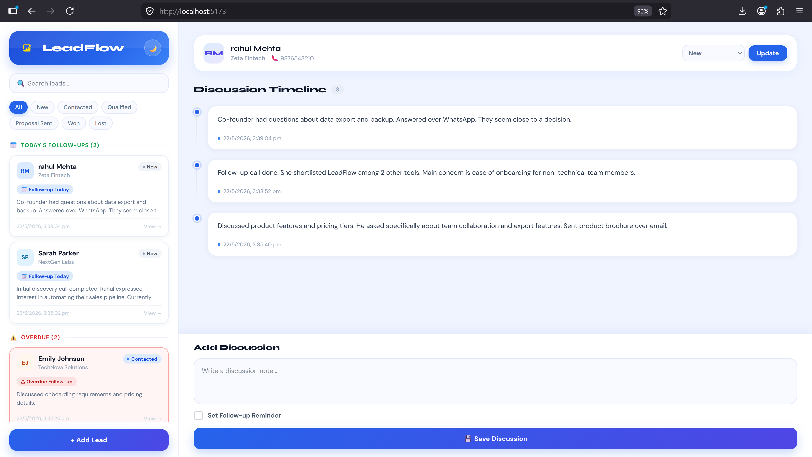

# LeadFlow CRM

**LeadFlow** helps businesses manage leads, track discussions, schedule follow-ups, and monitor overdue conversations through a clean, intuitive split-panel dashboard.
Built with **React, Vite, Node.js, Express.js, PostgreSQL, and Docker** — fully containerized so you can spin it up with a single command.

---

## Features

- **Lead Management** — Add and manage leads across 6 pipeline stages
- **Discussion Timeline** — Log every interaction with a visual, chronological timeline per lead
- **Follow-up Reminders** — Schedule follow-ups with date & time; never miss a call
- **Overdue Detection** — Automatically flags leads whose follow-up time has passed
- **Today's Follow-Ups** — Quickly see which leads need attention today
- **Status Tracking** — Move leads from New → Won or Lost with one click
- **Search & Filter** — Instantly search by name or filter by status
- **Dark Mode** — Full dark mode support across the app
- **Split-Panel Dashboard** — Sidebar for leads, right panel for timeline — everything in one view
- **Dockerized Setup** — One command starts frontend, backend, database, and pgAdmin together

---

## Tech Stack

| Layer    | Technology              |
| -------- | ----------------------- |
| Frontend | React, Vite, JavaScript |
| Backend  | Node.js, Express.js     |
| Database | PostgreSQL, pgAdmin     |
| DevOps   | Docker, Docker Compose  |

---

## Getting Started

### Prerequisites

Make sure **Docker Desktop** is installed and running:
[Download Docker Desktop](https://www.docker.com/products/docker-desktop/)

### Run the Project

1. Clone the repository:

```bash
git clone https://github.com/smitastack/Leadflow-CRM.git
```

2. Navigate to the project folder:

```bash
cd Leadflow-CRM
```

3. Start the application:

```bash
docker-compose up --build
```

> This single command automatically:
>
> - Builds the frontend container
> - Builds the backend container
> - Starts PostgreSQL database & pgAdmin
> - Connects all services together

---

## Application URLs

| Service     | URL                                            |
| ----------- | ---------------------------------------------- |
| Frontend    | [http://localhost:5173](http://localhost:5173) |
| Backend API | [http://localhost:5000](http://localhost:5000) |
| pgAdmin     | [http://localhost:5050](http://localhost:5050) |

### Stop the Application

```bash
docker-compose down
```

---

## Environment Variables

Create a `.env` file inside the `server/` folder:

```env
DB_HOST=postgres
DB_PORT=5432
DB_USER=postgres
DB_PASSWORD=postgres
DB_NAME=leadflow
```

An `.env.example` file is included for reference.

---

## Lead Pipeline Stages

```text
New → Contacted → Qualified → Proposal Sent → Won / Lost
```

---

## Follow-Up Logic

**Today's Follow-Ups** — A lead appears here when:

- Follow-up date is today
- Follow-up time has not yet passed
- Lead status is not Won or Lost

**Overdue** — A lead appears here when:

- Follow-up time has already passed
- Lead status is not Won or Lost

---

## Example Workflow

1. Add a new lead (name, company, phone)
2. Open the lead's timeline panel
3. Log a discussion note after every interaction
4. Schedule a follow-up reminder with date and time
5. Monitor Today's Follow-Ups each morning
6. Track Overdue leads to avoid missed interactions
7. Update lead status to Won or Lost to close the loop

---

## Screenshots

### Dashboard


### Add Lead


### Discussion Timeline



---

## Folder Structure

```text
leadflow/
│
├── client/
│   ├── public/
│   ├── src/
│   │   ├── assets/
│   │   │   └── leadflow-logo.png
│   │   ├── components/
│   │   │   ├── AddLeadModal.jsx
│   │   │   ├── LeadCard.jsx
│   │   │   └── LeadTimelinePanel.jsx
│   │   ├── App.jsx
│   │   ├── index.css
│   │   └── main.jsx
│   ├── Dockerfile
│   ├── vite.config.js
│   └── package.json
│
├── server/
│   ├── db.js
│   ├── index.js
│   ├── initDb.js
│   ├── seed.js
│   ├── Dockerfile
│   ├── .env
│   ├── .env.example
│   └── package.json
│
├── screenshots/
│   ├── dashboard.png
│   ├── discussionTimeline.png
│   └── AddLead.png
│
├── docker-compose.yml
├── .gitignore
└── README.md
```

---

## Key Components

- **App.jsx** — Dashboard layout, lead fetching, search, filtering, follow-up grouping, sorting, dark mode
- **AddLeadModal.jsx** — New lead form with validation and API integration
- **LeadCard.jsx** — Lead preview with status badge, overdue/today alerts, last discussion snippet
- **LeadTimelinePanel.jsx** — Full discussion history, follow-up scheduling, status updates

---

## Future Improvements

- Authentication system
- Email reminders
- Push notifications
- Team collaboration
- Analytics dashboard
- Calendar integration
- Lead priority system
- Mobile optimization

---

## Author

**Smita Sarangi**
