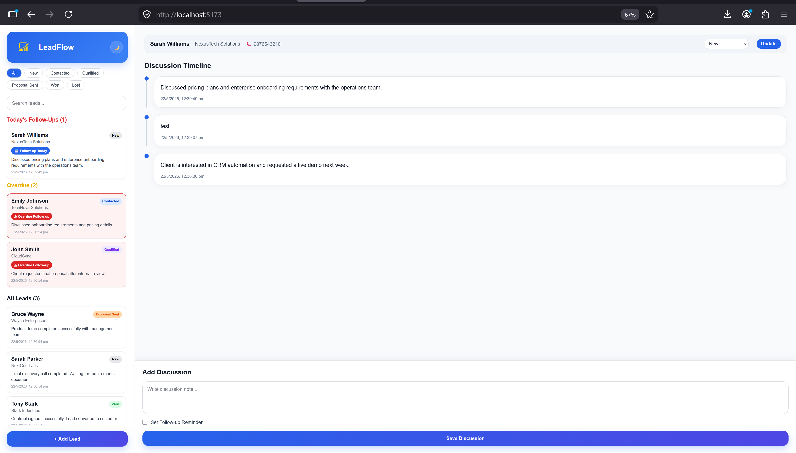
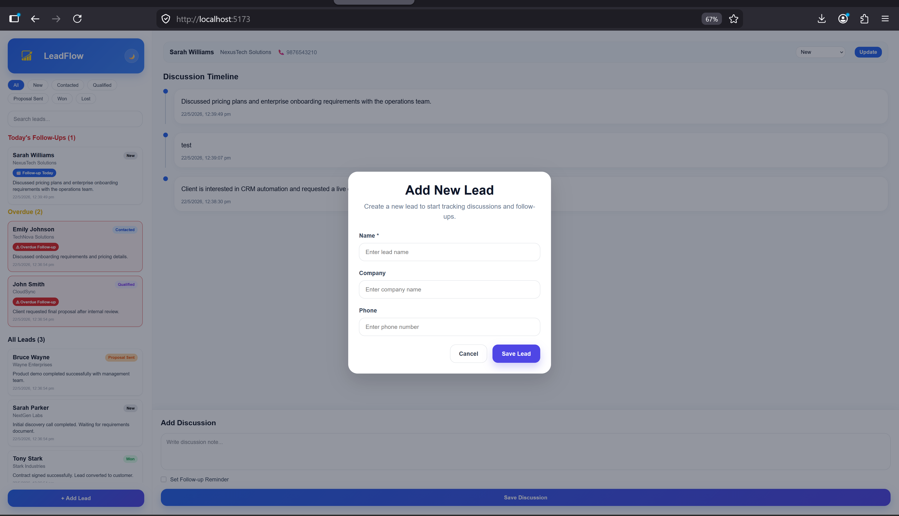

# LeadFlow CRM

LeadFlow is a modern lead management CRM built using React, Vite, Node.js, Express.js, PostgreSQL, and Docker.

It helps businesses manage leads, track discussions, schedule follow-ups, and monitor overdue conversations through a clean and intuitive interface.

The project is fully Dockerized so reviewers and developers do not need to manually install or configure PostgreSQL and pgAdmin locally.

---

# Features

- Add and manage leads
- Track discussion history
- Schedule follow-up reminders
- Automatic overdue follow-up detection
- Today's follow-up section
- Overdue lead tracking
- Lead status management
- Search and filter leads
- Dark mode support
- Responsive split-panel dashboard
- Beautiful discussion timeline UI
- Dockerized full-stack setup

---

# Tech Stack

## Frontend

- React
- Vite
- JavaScript
- Inline CSS

## Backend

- Node.js
- Express.js

## Database

- PostgreSQL
- pgAdmin

## DevOps / Containerization

- Docker
- Docker Compose

---

# Screenshots

## Dashboard



---

## Add Lead Modal



---

# Folder Structure

```bash
leadflow/
│
├── client/
│   ├── public/
│   ├── src/
│   │   ├── assets/
│   │   │   ├── hero.png
│   │   │   └── leadflow-logo.png
│   │   │
│   │   ├── components/
│   │   │   ├── AddLeadModal.jsx
│   │   │   ├── LeadCard.jsx
│   │   │   └── LeadTimelinePanel.jsx
│   │   │
│   │   ├── App.jsx
│   │   ├── index.css
│   │   └── main.jsx
│   │
│   ├── Dockerfile
│   ├── vite.config.js
│   └── package.json
│
├── server/
│   ├── db.js
│   ├── index.js
│   ├── initDb.js
│   ├── seed.js
│   ├── Dockerfile
│   ├── .env
│   ├── .env.example
│   └── package.json
│
├── screenshots/
│   ├── dashboard.png
│   └── AddLead.png
│
├── docker-compose.yml
├── .gitignore
└── README.md
```

---

# How to Run the Project

## Prerequisites

Before running the project, make sure Docker Desktop is installed and running.

Download Docker Desktop:

- Windows / Mac:
  https://www.docker.com/products/docker-desktop/

---

# Steps to Run the Project

## 1. Clone the Repository

```bash
git clone <your-repository-url>
```

---

## 2. Navigate to Project Folder

```bash
cd leadflow
```

---

## 3. Start the Application

Run the following command:

```bash
docker-compose up --build
```

This command automatically:

- Builds frontend container
- Builds backend container
- Starts PostgreSQL database
- Starts pgAdmin
- Connects all services together

---

# Application URLs

## Frontend

```bash
http://localhost:5173
```

---

## Backend API

```bash
http://localhost:5000
```

---

## pgAdmin

```bash
http://localhost:5050
```

---

# Stop the Application

To stop all running containers:

```bash
docker-compose down
```

---

# Environment Variables

Create a `.env` file inside the `server` folder.

Example:

```env
DB_HOST=postgres
DB_PORT=5432
DB_USER=postgres
DB_PASSWORD=postgres
DB_NAME=leadflow
```

---

# Lead Statuses

LeadFlow supports the following lead stages:

- New
- Contacted
- Qualified
- Proposal Sent
- Won
- Lost

---

# Follow-Up Logic

## Today's Follow-Ups

A lead appears inside **Today's Follow-Ups** when:

- Follow-up date is today
- Follow-up time has not passed yet
- Lead status is not `Won`
- Lead status is not `Lost`

---

## Overdue Leads

A lead appears inside **Overdue** when:

- Follow-up time has already passed
- Lead status is not `Won`
- Lead status is not `Lost`

---

# Main Components

## App.jsx

Handles:

- Dashboard layout
- Lead fetching
- Search and filtering
- Follow-up grouping
- Lead sorting
- Dark mode

---

## AddLeadModal.jsx

Handles:

- Adding new leads
- Form validation
- API integration for lead creation

---

## LeadCard.jsx

Displays:

- Lead details
- Status badges
- Follow-up reminders
- Overdue alerts

---

## LeadTimelinePanel.jsx

Handles:

- Discussion timeline
- Discussion history
- Follow-up scheduling
- Lead status updates

---

# Example Workflow

1. Add a new lead
2. Open lead timeline
3. Add discussion notes
4. Schedule a follow-up reminder
5. Monitor today's follow-ups
6. Track overdue leads
7. Update lead status to Won or Lost

---

# Future Improvements

- Authentication system
- Email reminders
- Push notifications
- Team collaboration
- Analytics dashboard
- Calendar integration
- Lead priority system
- Mobile optimization

---

# Author

Smita Sarangi
